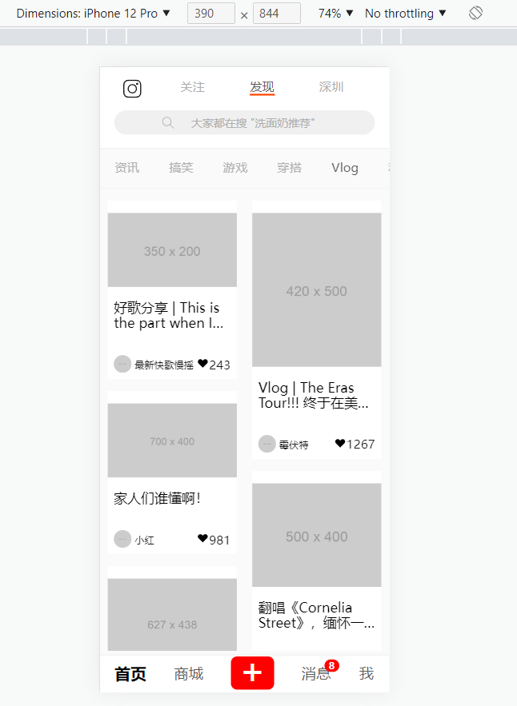

# Uni-Infinite-Scrolling ⭐ 无限滚动瀑布流

This is a simple infinite scrolling realization, which used Vue3, Vite, TypeScript, Scss/Sass, Uniapp(DCloud), Normalize.css etc.. Uni stands for Uniapp the frame developed by DCloud.

Several algorithms and performance optimization included, such as handwriting debounce, throttle and so on.

Project views are developed with references to a Chinese app called Xiaohongshu (a.k.a. Red Little Book) interface, whose natural language is based in Mandarin.

Placeholder images are from [Placeholder](https://placehold.it).

这是一个简单的图文无限滚动瀑布流实现，使用技术涉及Vue3, Vite, TypeScript, Scss/Sass, Uniapp, Nomarlize.css等。

包含一部分算法以及性能优化内容，如手写的节流与防抖等。

项目语言为中文，参考了小红书的界面。

占位图来自[Placeholder](https://placehold.it)。

# Preview ⭐ 预览

These two preview pages are ran in real iPhone 12 Pro Safari (Address bar hidden) and Google Chrome (F12 Mobile Mode).

预览画面来自于iPhone 12 Pro Safari真机画面（隐藏地址栏）以及Google Chrome（F12开发者工具移动端模式）。

## Google Chrome

## Safari (iPhone 12 Pro)

.PNG "Safari (iPhone 12 Pro)")

.PNG "Safari (iPhone 12 Pro)")

.PNG "Safari (iPhone 12 Pro)")

# To Build & Notes ⭐ 构建方法与注意事项

0. If the node environment is still unloaded, please run `npm install` in powershell first.

    如果无Node环境，请先在终端运行 `npm install`。

1. Use `dev:h5` or `uni` to run in development mode (`dev:h5:net` or `uni --host` for both local and network server).

    使用 `dev:h5` 或 `uni` 在开发模式下运行 (使用 `dev:h5:net` 或 `uni --host` 可同时开启本地服务器与网络服务器)。

2. Use `build:h5` or `uni build` to pack through Vite to production environment (Server or virtual server like Live Server needed).

    使用 `build:h5` 或 `uni build` 通过Vite打包到生产环境。（需要服务器环境）

3. Due to the features of Uniapp(DCloud) Frame, this project can be packed to various platforms within considerable compatibility (NOT 100% FULLY). You can look up the `package.json` file to see platforms supported. This is fully developed for H5 page initially.

    因为Uniapp框架的特性，这个项目可以打包到多个平台并保持较好的兼容性（但不是100%兼容）。您可以通过查看项目文件 `package.json` 来获取支持打包的平台。项目初衷是开发H5页面。
